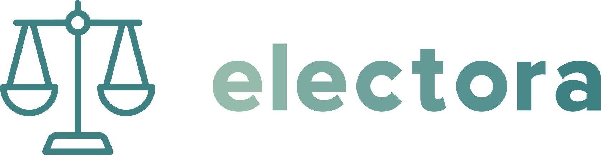

Electora is a privacy-first tool for DAOs to manage grant and scholarship programs, job applications, community decision-making, and any other use case where privacy matters. 

## Why Are We Building This?

The year 139 BC marked the introduction of the first of the four Tabellariae Leges, most widely known as the “ballot laws of the Roman Republic”.

Why are we talking about them after more than 2,000 years? Because they successfully limited the influence of the aristocratic class, reduced bribery, and expanded freedom of choice for voters, setting a new standard for governance mechanisms: privacy.

Privacy is a key component to building a new, better, more resilient system. It´s not just some specific use case. It´s enhancing every on-chain interaction. Electora is a private voting mechanism that can make everything more private: job applications, grant programs, nominations for scholarships, community decision-making, fellowship, service proposals, collective behavior, and, of course, legislation on how to transform an Italian city into the pioneer Ethereum-powered micro metropolis. 

## Our Tech and Use Cases

**Sismo**

Sismo is a key component of our product. We use Sismo groups to determine who can vote, but, most importantly, who can add new options (candidates) to an existing ballot.
What does this mean? This means that:

1. DAOs can create open ballots where a subset of community members define the options between which a subset of community members can vote.
2. People submitting options can demonstrate they satisfy the required criteria using ZK Proofs and therefore preserving their privacy.
3. We strongly encourage you to keep reading to explore together different use cases we can derive from this implementation.

**TalentLayer**

How do we use TalentLayer? We use TalentLayer's reputation and its integration with Sismo to allow companies, users, or DAOs to add work-related criteria to their ballots without compromising participants’ privacy.

Why? To enhance the labor market’s privacy, allowing workers and service providers to participate in Request-for-Proposal, grant programs or job applications without disclosing personal information or being subject to bias.

What is the novelty? While TalentLayer already has privacy-enhancing mechanisms, we bring this to situations in which voting is required.

Let’s explore a use case together:
- A DAO creates a Request-for-Proposal that only allows people who have already worked with the DAO to participate, and only allows people who have a given NFT to decide on which proposals to take (think of grants council member NFT). Users submitting options don’t have to disclose private information and voters are not biased.

- A company creates a job application that requires applicants to have verifiable experience in a given domain. Applicants can demonstrate they have the necessary skills without revealing additional information.

**ENS**

How do we use ENS? We allow ballot creators to include holding an ENS subdomain to create new options for the ballot (candidates) or to vote, all done privately through Sismo integration.

Why? To give communities more options on how to make decisions. While privacy can create some compromises for some big DAO decisions, there are many situations in which community members could be subject to strong peer pressure, especially in smaller communities which are the ones that typically gather under an ENS domain and use subdomains as a way to signal community involvement.

What is the novelty? We allow small communities using ENS subdomains to have private ballots.

Let´s go through a use case together:

- A community opens up a votation on whether to expel a community member or not and users vote without having to expose themselves to possible consequences of voting for either option.

**Talent Protocol**

How do we use Talent Protocol? We use Talent Protocol’s reputation to create a more efficient way for communities to elect their members to receive a grant, scholarship or membership.
We created a Sismo group that allows users to create ZK proofs of their Talent Protocol achievements. These ZK proofs can be used by ballot creators as a criterion to define who is able to propose options (think of nominations or submitting a proposal) and who is able to vote.

Why? Talent Protocol provides our tool with very valuable information concerning people’s reputations, which is essential for creating more fair compensation systems that consider skills and past achievements instead of popularity.

What is the novelty?
1. We are able to add privacy to existing election systems.
2. We bring enhanced granularity to the election system since ballot creators can define different criteria for users proposing options and users voting.
3. We take the results and election on-chain and allow for decentralized participation.

Here´s a possible use case (which might or might not be based on a true story):

- Talent Protocol could organize a scholarship program were the community votes privately. This will help Santi, who has 4 frens participating in the election and can only vote for one of them, but doesn’t want his frens to know who he voted for. It could also help Talent Protocol define very specific criteria for who can apply (by creating a new option on the ballot) and who can vote (by selecting one of the ballot options, ergo, one of the applicants).

**The Graph**

We created our own subgraph to allow anyone to get information on what’s happening on our platform.
